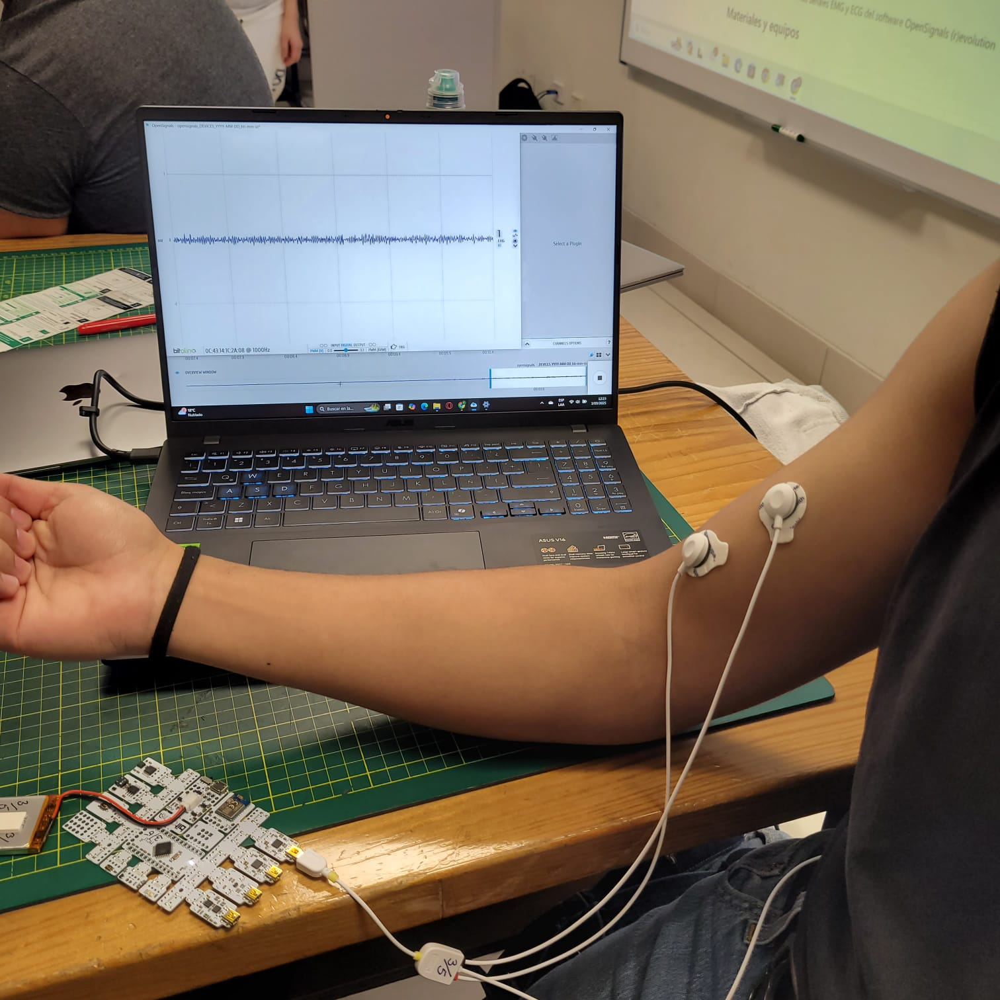
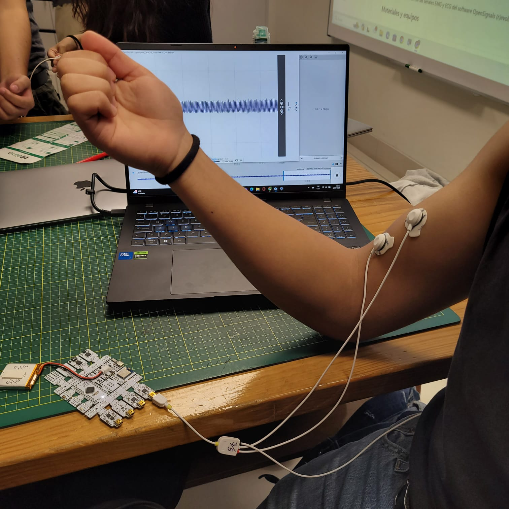

# Índice
- [1. Introduccion](#1-introduccion)
- [2. Objetivos del laboratorio](#2-objetivos-del-laboratorio)
- [3. Materiales y equipo](#3-materiales-y-equipo)
- [4. Procedimiento](#4-procedimiento)
  - [4.1. Experimento 1: Bíceps ](#41-experimento_1_biceps)
    - [4.1.1. Conexión correcta de los electrodos en el bíceps](#4.1.1.-conexion_correcta_de_los_electrodos_en_el_biceps)
    - [4.1.2. Prueba 1](#4.1.2.-prueba_1)
    - [4.1.3. Prueba 2](#4.1.3.-prueba_1)
    - [4.1.4. Prueba 3](#4.1.4.-prueba_1)
  - [4.2. Experimento 2: Tríceps ](#4.2.-experimento_2_triceps)
    - [4.2.1. Conexión correcta de los electrodos en el tríceps](#4.1.1.-conexion_correcta_de_los_electrodos_en_el_triceps)
    - [4.2.2. Prueba 1](#4.2.2.-prueba_1)
    - [4.2.3. Prueba 2](#4.2.3.-prueba_1)
    - [4.2.4. Prueba 3](#4.2.4.-prueba_1)
- [5. Señales EMG ploteadas en Python](#5-señales-emg-ploteadas-en-python)  
  - [5.1. Bíceps braquial](#5.1-bíceps-braquial)  
    - [5.1.1. Señal EMG en reposo](#5.1.1.-señal-emg-en-reposo)  
    - [5.1.2. Señal EMG de una flexión lenta](#5.1.2.-señal-emg-de-una-flexión-lenta)  
    - [5.1.3. Señal EMG de una flexión con fuerza opositora](#5.1.3.-señal-emg-de-una-flexión-con-fuerza-opositora)  
  - [5.2. Tríceps braquial](#5.2.-tríceps-braquial)  
    - [5.2.1. Señal EMG en reposo](#5.2.1.-señal-emg-en-reposo)  
    - [5.2.2. Señal EMG de una extensión lenta](#5.2.2.-señal-emg-de-una-extensión-lenta)   
    - [5.2.3. Señal EMG de una extensión con fuerza opositora](#5.2.3.-señal-emg-de-una-extensión-con-fuerza-opositora)
- [6. Referencias](#6-referencias)

# 1. Introduccion
### ¿Qué es el EMG? 🧠  
El electromiograma (EMG) es una técnica que permite registrar la actividad eléctrica generada por los músculos esqueléticos durante su contracción. Esta actividad proviene de los potenciales de acción que se propagan a lo largo de las fibras musculares cuando son activadas por el sistema nervioso.  
En el caso del EMG de superficie (sEMG), se utilizan electrodos colocados sobre la piel para detectar estas señales. Los electrodos no penetran el cuerpo, sino que captan los cambios de voltaje que ocurren justo debajo de la piel, generados por la suma de múltiples unidades motoras activas.

### ¿Para qué sirve? ⚡  
- Ayuda a entender si un músculo está funcionando bien o no.  
- Se usa en medicina para detectar problemas nerviosos o musculares.  
- También sirve en deportes y rehabilitación para ver cómo se activan los músculos.

### ¿Cómo se hace? 🩺  
- Se colocan sensores en la piel, cerca del músculo que se quiere estudiar.  
- La persona mueve el músculo, y el EMG muestra las señales en una pantalla.  
- Es rápido, no duele, y da información útil para médicos y terapeutas.

# 2. Objetivos del laboratorio
- Configuración precisa del sistema BiTalino para adquisición electromiográfica.  
- Captura de bioseñales musculares en los movimientos de contracción del bíceps y tríceps mediante EMG de superficie.  
- Procesamiento y análisis de datos EMG utilizando la plataforma OpenSignals (r)evolution y Python.

# 3. Materiales y equipo

| Modelo       | Descripción   | Cantidad |
|:------------:|:-------------:|:--------:|
| (R)EVOLUTION | Kit BITalino  |    1     |
| -            | Laptop        |    1     |

  

# 4. Procedimiento

Se realizaron dos experimentos de registro de señales EMG: el primero en el bíceps y el segundo en el tríceps. En las siguientes secciones se detalla la ubicación de los electrodos en cada músculo, así como los resultados obtenidos en cada caso.

**Esquema de conexión de electrodos**

Para el registro de la señal EMG en el bíceps se empleó el sensor de 3 electrodos de la placa BITalino, siguiendo las recomendaciones del manual de uso.

|  |  |
|:---------------------------------------------:|:--------------------------------------------:|
| **Sensor EMG de 3 electrodos** | **Esquema de conexión de los electrodos** |

## 4.1. Experimento 1: Bíceps

### 4.1.1. Conexión correcta de los electrodos en el bíceps

En la conexión correcta se observa una señal limpia y representativa de la actividad muscular.
En la conexión incorrecta, debido a una mala colocación de los electrodos, la señal registrada presenta un nivel elevado de ruido, lo cual dificulta el análisis adecuado.

|**Conexión correcta ✅**|**Conexión incorrecta ❌**|
|:------------------|:--------------------|
|  |  |
| - **Electrodo rojo (+):** bíceps (zona activa) - **Electrodo negro (–):** bíceps (zona pasiva) - **Electrodo blanco:** espina ilíaca antero-superior (referencia) | - **Electrodo rojo (+):** bíceps (zona activa) - **Electrodo negro (–):** espina ilíaca antero-superior (referencia) - **Electrodo blanco:** bíceps (zona pasiva) |

### 4.1.2. Prueba 1
Se registró la señal EMG con el participante en condición de reposo, a fin de establecer una línea base para posteriores comparaciones.

  

### 4.1.3. Prueba 2
El participante realizó flexión del brazo derecho durante un intervalo de 40 segundos seguido de un período de 30 segundos de reposo. Este procedimiento se repitió en tres ciclos consecutivos.

  

### 4.1.4. Prueba 3
El participante efectuó flexión del brazo derecho contra resistencia externa, aplicada para impedir el movimiento completo. Posteriormente, se consideró un período de 30 segundos de reposo. Al igual que en la prueba anterior, este protocolo se repitió en tres ciclos consecutivos.

  

## 4.2. Experimento 2: Tríceps
### 4.2.1. Conexión correcta de los electrodos en el tríceps

  

Para el registro de la señal EMG en el músculo tríceps se empleó la configuración de tres electrodos:
- **Electrodo rojo (+)**: tríceps (zona activa)
- **Electrodo negro (-)**: tríceps (zona pasiva)
- **Electrodo blanco**: espina ilíaca antero-superior (referencia)

### 4.2.2. Prueba 1
Se registró la señal EMG con el participante en condición de reposo, a fin de establecer una línea base para posteriores comparaciones.

  

### 4.2.3. Prueba 2
El participante realizó la extensión del brazo derecho durante un intervalo de 40 segundos seguido de un período de 30 segundos de reposo. Este procedimiento se repitió en tres ciclos consecutivos.

  

### 4.2.4. Prueba 3
El participante efectuó la extensión del brazo derecho contra resistencia externa, aplicada para impedir el movimiento completo. Posteriormente, se consideró un período de 30 segundos de reposo. Al igual que en la prueba anterior, este protocolo se repitió en tres ciclos consecutivos.

  

## 5. Señales EMG ploteadas en Python
### 5.1. Bíceps braquial
Se evaluó mediante señales EMG en 3 condiciones al músculo bíceps braquial: en reposo, en una flexión lenta y controlada del brazo y en una flexión del brazo con una fuerza opositoria. Todas las pruebas fueron realizadas con el sujeto sentado.

#### 5.1.1. Señal EMG en reposo

  

#### 5.1.2. Señal EMG de una flexión lenta
##### Intento 1: 

  

##### Intento 2: 

  

##### Intento 3: 

  

#### 5.1.3. Señal EMG de una flexión con fuerza opositora
##### Intento 1: 

  

##### Intento 2: 

  

##### Intento 3: 

  

### 5.2. Tríceps braquial
Se evaluó mediante señales EMG en 3 condiciones al músculo tríceps braquial: en reposo, en una extensión lenta y controlada del brazo y en una extensión del brazo con una fuerza opositoria. Todas las pruebas fueron realizadas con el sujeto sentado.

#### 5.2.1. Señal EMG en reposo

  

#### 5.2.2. Señal EMG de una extensión lenta
##### Intento 1: 

  

##### Intento 2: 

  

##### Intento 3: 

  

#### 5.2.3. Señal EMG de una extensión con fuerza opositora
##### Intento 1: 

  

##### Intento 2: 

  

##### Intento 3: 

  

