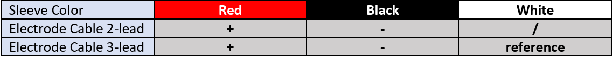
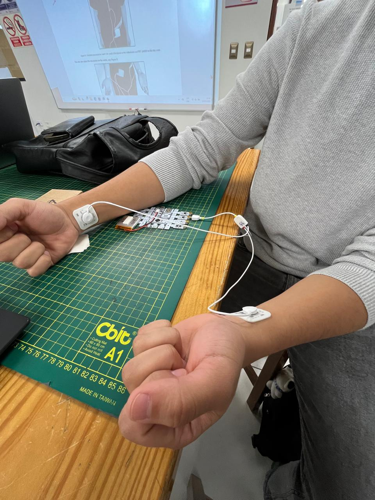

- [1. Introducción](#1-introducción)
- [2. Objetivos del laboratorio](#2-objetivos-del-laboratorio)
- [3. Materiales y equipo](#3-materiales-y-equipo)
- [4. Procedimiento](#4-procedimiento)
  - [4.1. Experimento](#41-experimento)
    - [4.1.1. Conexión de los electrodos](#411-conexión-de-los-electrodos)
    - [4.1.2. Prueba 1](#412-prueba-1)
    - [4.1.3. Prueba 2](#413-prueba-2)
    - [4.1.4. Prueba 3](#414-prueba-3)
- [4. Metodología](#4-metodología)
- [5. Señales ECG ploteadas en Python](#5-señales-ecg-ploteadas-en-python)
- [6. Conclusiones](#6-conclusiones)
- [7. Referencias](#referencias)

# 1. Introducción 
Un electrocardiograma (ECG) es un procedimiento sencillo, no invasivo y de rápida ejecución que registra la actividad eléctrica del corazón. Cada vez que el corazón late, una señal eléctrica recorre el músculo cardíaco, estimulando sus cámaras para que se contraigan y bombeen sangre al cuerpo. El ECG es una herramienta clave para revisar el estado del corazón cuando se sospecha algún problema. Permite detectar alteraciones como arritmias, enfermedades del músculo cardíaco o problemas en las arterias. Su funcionamiento se basa en captar la actividad eléctrica del corazón a través de electrodos colocados en la piel. Además, el electrocardiograma ayuda a que distintos profesionales de salud trabajen juntos para brindar una mejor atención al paciente [1].
# 2. Objetivos del laboratorio 
- Registrar señales ECG en reposo, respiración y ejercicio.
- Evaluar calidad de señal según acoplamiento electrodo-piel.
- Usar Python y OpenSignals para análisis de la señal obtenida.

# 3. Materiales y equipo

| Modelo       | Descripción   | Cantidad |
|:------------:|:-------------:|:--------:|
| (R)EVOLUTION | Kit BITalino  |    1     |
| -            | Laptop        |    1     |

  

# 4. Procedimiento

Se llevó a cabo un experimento de registro de la señal electrocardiográfica (ECG). Para ello, se describe en primer lugar la colocación de los electrodos, asegurando un contacto adecuado con la piel para mejorar la calidad del registro. Posteriormente, se realizan las mediciones correspondientes en distintas condiciones fisiológicas del participante y se presentan los resultados obtenidos en cada etapa del procedimiento con el objetivo de evaluar la actividad eléctrica cardíaca en un entorno controlado.

**Esquema de conexión de electrodos**

Para el registro de la señal EMG en el bíceps se empleó el sensor de 3 electrodos de la placa BITalino, siguiendo las recomendaciones del manual de uso.

|  |  |
|:---------------------------------------------:|:--------------------------------------------:|
| **Sensor EMG de 3 electrodos** | **Esquema de conexión de los electrodos** |

Fuente: PLUX Wireless Biosignals, "Electromyography (EMG) User Manual" [2].

## 4.1. Experimento

### 4.1.1. Conexión de los electrodos 

En este experimento, para la adquisición de la señal electrocardiográfica (ECG), se utilizó la configuración clásica de Einthoven para la colocación de los electrodos. El electrodo rojo se ubicó en la muñeca izquierda, el electrodo negro en la muñeca derecha y el electrodo blanco (referencia) se colocó sobre la espina ilíaca antero-superior. Esta disposición permite registrar de forma adecuada la actividad eléctrica del corazón al establecer un vector de diferencia de potencial entre ambos brazos, mientras que el electrodo de referencia cumple la función de estabilizar la señal y atenuar el ruido generado por interferencias externas o movimientos del participante. De esta manera, fue posible obtener un registro más claro y confiable, adecuado para el análisis posterior. 

  

### 4.1.2. Prueba 1
Se registró la señal ECG del participante en condición de reposo, con el objetivo de establecer una línea de base estable y representativa de la actividad cardíaca en ausencia de esfuerzo físico. Esta referencia inicial resulta fundamental, ya que permite realizar comparaciones posteriores y evaluar de manera más precisa las variaciones en la señal producidas por diferentes condiciones fisiológicas. 

  

### 4.1.3. Prueba 2
El participante mantuvo la respiración durante 30 segundos seguido de un periodo de recuperación de 1 minuto. Este procedimiento se repitió en tres ciclos consecutivos con el propósito de observar la influencia de la retención de la respiración sobre la actividad eléctrica cardíaca. De esta manera, fue posible registrar y comparar las variaciones en la señal ECG asociadas tanto al esfuerzo fisiológico como a la posterior fase de recuperación.

  

### 4.1.4. Prueba 3
El participante llevó a cabo una actividad física aeróbica que consistió en subir y bajar escaleras durante un periodo aproximado de 15 minutos. Este tipo de ejercicio, al implicar un esfuerzo dinámico y sostenido, favorece el incremento de la frecuencia cardíaca y la demanda metabólica, generando así un estímulo adecuado para evaluar cómo la actividad eléctrica del corazón se modifica frente a condiciones de esfuerzo físico prolongado. 

  

Finalizado el ejercicio, se procedió a la colocación de los electrodos y al registro de la señal en condición de reposo durante 1 minuto. Esta etapa permitió observar el proceso de recuperación fisiológica del participante y establecer un contraste entre la actividad eléctrica cardíaca posterior al esfuerzo y la línea de base previamente registrada, asegurando así un análisis más preciso de las variaciones inducidas por la actividad física.

  

# 5. Señales ECG ploteadas en Python
Se graficó en Python la señal obtenida por el dispositivo **BITalino**, lo que permitió un análisis detallado del **ECG**.  
Este paso es fundamental, ya que posibilita identificar con mayor precisión los **complejos QRS**, necesarios para el cálculo de los **latidos por minuto (lpm)**.

Para determinar la frecuencia cardíaca, se midieron los **intervalos R-R**, es decir, la distancia temporal entre picos R consecutivos de la señal.

Dado que se trata de un ECG con **ritmo regular**, el cálculo se simplifica aplicando la siguiente fórmula:

$$
\text{Lpm} = \frac{60}{\text{Intervalo R-R (s)}}
$$

Previo a ello, fue necesario convertir el número de muestras en **segundos**, empleando la frecuencia de muestreo configurada en el BITalino (f = 1000Hz)

Adicionalmente, se realizó un análisis espectral mediante la **Transformada Rápida de Fourier (FFT)**.  
Este procedimiento permitió observar la **distribución de frecuencias** contenidas en la señal ECG, lo cual facilita la identificación de posibles **componentes de ruido**.

El **BITalino** integra un sistema de **acondicionamiento analógico previo**, que incluye filtrado de hardware.  
Dicho sistema atenúa gran parte de las interferencias antes de la digitalización, por lo que no fue necesario aplicar un filtrado digital adicional en el procesamiento de la señal.

---
### 5.1. Señal ECG en reposo
El usuario se encontraba en reposo por lo que este representa su estado basal, además se puede medir el valor del intervalo R-R calculando el tiempo entre los picos en 4.9s y 5.72s, lo cual representa un intervalo R-R de 0.82s. Ello equivale a **73.17 latidos por minuto**, lo cual está dentro del rango normal de palpitaciones cardíacas.

  

  

### 5.2. Señal ECG conteniendo el aire
El usuario contuvo la respiración durante 30 segundos, y después descansó durante 1 minuto. 

En la tercera gráfica de esta sección se puede observar el espectro completo, se puede evidenciar como la amplitud de la señal vuelve a aumentar una vez que el usuario finaliza la contención del aire. Ello se puede explicar porque, al contener la respiración, aumenta la presión intratorácica y esto disminuye el retorno venoso hacia el corazón, reduciendo así el volumen sistólico. A la vez, se activa el reflejo vagal, lo que genera un predominio parasimpático que tiende a enlentecer y estabilizar la frecuencia cardiaca. Sin embargo, una vez que se retoma la respiración, la presión intratorácica vuelve a la normalidad, el retorno venoso mejora y el corazón se llena de manera más adecuada, lo que se manifiesta como una recuperación en la amplitud de la señal.

El tiempo entre los picos en 10.98s y 11.82s representa un intervalo R-R de 0.84s. Ello equivale a **71.42 latidos por minuto**.

  

  

  

Si evaluáramos los latidos por minuto en su etapa de recuperación tendríamos que el tiempo 34.88s y 35.66s representa un intervalo R-R de 0.78s. Ello equivale a **76.92 latidos por minuto**.

  

#### 5.3. Señal ECG después de actividad aeróbica
El usuario fue sometido a actividad física de 11 minutos, inmediatamente después se le realizó la medición.
El tiempo entre los picos en 4.06s y 4.68s representa un intervalo R-R de 0.62s. Ello equivale a **96.77 latidos por minuto**.

  

  

##### - Archivos EGC:
[Documentos txt Bitalino](https://github.com/PamelaVilchez/GRUPO-08-ISB-2025-II/tree/a3c40e49cffb82b3eea75ac27e97558f57f93680/Repositorio-Im%C3%A1genes/Archivos-ECG)

# 6. Conclusiones
- La adquisición de señales ECG mediante el sistema BITalino, empleando la configuración clásica de Einthoven, permitió obtener registros de alta calidad en distintas condiciones fisiológicas. La correcta colocación de los electrodos y el acoplamiento adecuado con la piel fueron determinantes para minimizar interferencias y garantizar una señal estable. El sistema de acondicionamiento analógico previo del BITalino demostró ser eficaz, ya que no fue necesario aplicar filtrado digital adicional durante el procesamiento en Python.

- Los resultados obtenidos evidencian una variabilidad fisiológica coherente en la frecuencia cardíaca del participante. En estado de reposo, se registró una frecuencia de 73.17 latidos por minuto, lo cual representa una línea de base estable. Durante la contención de la respiración, la frecuencia disminuyó ligeramente a 71.42 lpm, reflejando una activación del sistema parasimpático y una reducción del retorno venoso. Posteriormente, en la fase de recuperación, se observó un incremento a 76.92 lpm, lo que indica una normalización progresiva de la función cardíaca. Finalmente, tras la actividad aeróbica, la frecuencia aumentó significativamente a 96.77 lpm, como respuesta esperada al esfuerzo físico sostenido y al incremento de la demanda metabólica.

- El análisis espectral mediante la Transformada Rápida de Fourier permitió identificar la distribución de frecuencias presentes en cada condición. En reposo, predominan componentes de baja frecuencia, mientras que tras el ejercicio se observa una mayor amplitud espectral, lo que refleja la activación fisiológica del sistema cardiovascular. No se detectaron artefactos relevantes ni picos anómalos, lo que valida la calidad del registro y la eficacia del sistema de adquisición.

- En conjunto, el protocolo implementado demuestra ser una herramienta robusta para evaluar la actividad eléctrica cardíaca en condiciones controladas. La integración de Python para el análisis automatizado de señales ECG, junto con la trazabilidad de los datos obtenidos, ofrece un enfoque reproducible y aplicable tanto en investigación biomédica como en entornos clínicos rurales. Este tipo de estudios permite comprender mejor la respuesta del corazón ante distintos estímulos fisiológicos y abre la posibilidad de desarrollar sistemas de monitoreo remoto adaptados a contextos con recursos limitados.

# 7. Referencias
 [1]. Y. Sattar and L. Chhabra, “Electrocardiogram,” StatPearls - NCBI Bookshelf, Jun. 05, 2023. https://www.ncbi.nlm.nih.gov/books/NBK549803/
 [2] PLUX Wireless Biosignals, "Electromyography (EMG) User Manual," Nov. 2021. [Online]. Available: https://support.pluxbiosignals.com/wp-content/uploads/2021/11/electromyography-emg-user-manual.pdf.
