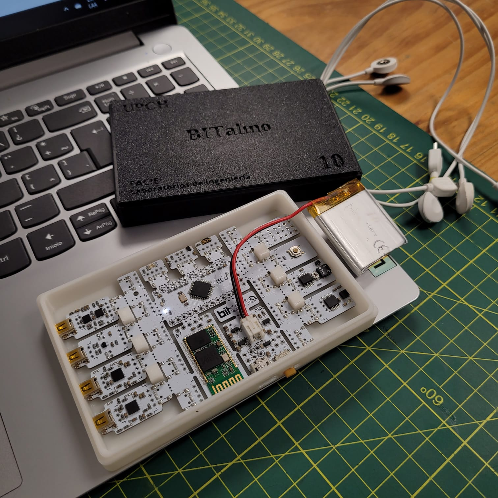
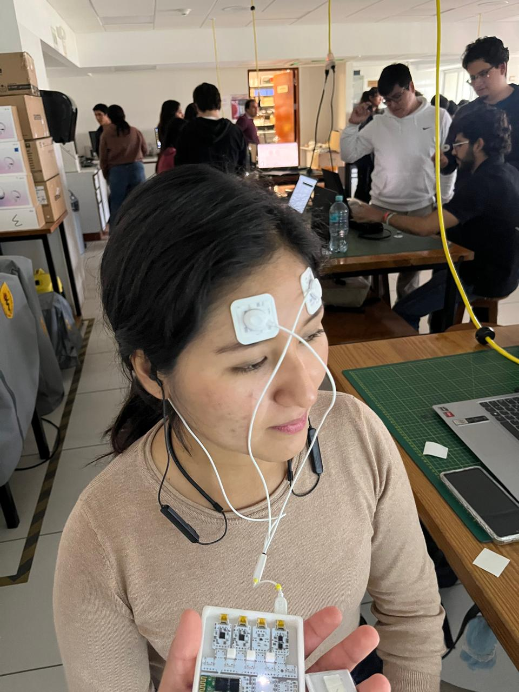
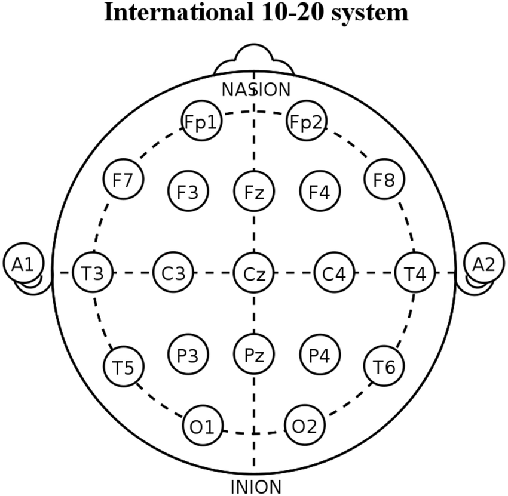
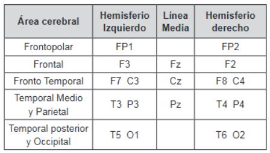

 # Índice
- [1. Introducción](#1-introducción)
- [2. Objetivos del laboratorio](#2-objetivos-del-laboratorio)

- [5. Señales ploteadas en Python](#5-señales-ploteadas-en-python)
  - [Señales EEG obtenidas del BITalino](#señales-eeg-obtenidas-del-bitalino)
    - [Señal EEG basal (Reposo)](#señal-eeg-basal-reposo)
    - [Señal EEG con ojos abiertos](#señal-eeg-con-ojos-abiertos)
    - [Señal EEG con ojos cerrados](#señal-eeg-con-ojos-cerrados)
    - [Señal EEG restando 7 desde 100](#señal-eeg-restando-7-desde-100)
    - [Señal EEG con artefactos](#señal-eeg-con-artefactos)
    - [Señal EEG escuchando música](#señal-eeg-escuchando-música)
      - [Género Rock](#rock)
      - [Género Pop](#pop)
  - [Gráficas de OpenBCI](#gráficas-de-openbci)
    - [Gráfica de las señales de los 8 canales](#gráfica-de-las-señales-de-los-8-canales)
    - [Frecuencias de los 8 canales](#frecuencias-de-los-8-canales)
    - [Frecuencias de los 8 canales superpuestas](#frecuencias-de-los-8-canales-superpuestas)

- [7. Referencias](#7-referencias)

# 1. Introducción 
El electroencefalograma (EEG) es una técnica neurofisiológica no invasiva que permite registrar la actividad eléctrica de las neuronas 
corticales mediante electrodos ubicados en el cuero cabelludo. Esta actividad se manifiesta en forma de ondas cerebrales, caracterizadas 
por su frecuencia y amplitud, parámetros que reflejan los distintos estados funcionales del cerebro [1].

Las principales bandas de frecuencia del EEG son: delta (δ), theta (θ), alfa (α) y beta (β), cada una asociada a condiciones específicas 
como el sueño profundo, la relajación, el reposo vigilante o la actividad cognitiva intensa. Aunque el EEG no permite evaluar directamente 
la actividad de estructuras profundas como el tronco encefálico o el cerebelo, constituye una herramienta esencial para el estudio de la 
dinámica cortical, tanto en condiciones de reposo como durante la ejecución de tareas [1].

Además de su valor en la investigación neurocientífica, el EEG tiene una amplia aplicación clínica, ya que permite detectar alteraciones 
en la actividad cerebral que pueden contribuir al diagnóstico de epilepsia, trastornos convulsivos, encefalopatías y otras disfunciones 
neurológicas [2].

# 2. Objetivos del laboratorio 
- Configurar adecuadamente el dispositivo BITalino (r)evolution Board Kit BLE/BT para la adquisición de señales EEG, garantizando la correcta colocación de los electrodos y la calidad de la señal registrada.
- Registrar señales EEG en diferentes condiciones experimentales: reposo, fijación visual, ojos cerrados, ejecución de una tarea cognitiva y durante una actividad libre.
- Preprocesar las señales EEG mediante la aplicación de un filtro pasa banda entre 0.8–48 Hz, con el fin de eliminar artefactos y aislar la actividad cerebral de interés.
- Identificar y analizar las principales bandas de frecuencia de la señal EEG (δ, θ, α y β), asociando cada una de ellas con los estados y actividades registradas.
- Implementar el análisis de señales EEG utilizando Python y el software OpenSignals, desarrollando un flujo de trabajo reproducible para la visualización e interpretación de los resultados.

# 3. Materiales 
| Equipo / material     | Cantidad |
|:-----------:|:--------:|
| BITalino Board BLE/BT |    1     |
| Laptop con Bluetooth 4.0+|    1     |
| Software OpenSignals |    -     |
| Electrodos Ag/AgCl (gel) |    3     |
| Ultracortex Mark IV (dry headset) |    1     |

  

### Seguridad y buenas prácticas
- Operar solo con batería (no mientras carga).
- Evitar piel lesionada y pacientes con implantes.
- Desinfección previa y retiro de objetos metálicos.
- Registrar artefactos (parpadeo, masticación) en cuaderno o video.
- Impedancia < 20 kΩ recomendada.

# 4. Metodología
## 4.1.1. Conexión de los electrodos
Antes del inicio del registro EEG, se procedió a la colocación de los electrodos siguiendo el sistema internacional 10–20, adaptado para configuración frontal [3]. Se utilizaron electrodos de tipo Ag/AgCl con gel conductor, asegurando una buena adherencia y baja impedancia de contacto.
El montaje se realizó de la siguiente manera:
- Electrodo activo: ubicado en la región Fp1, correspondiente al lóbulo frontal izquierdo. Esta posición permite captar actividad cortical relacionada con atención, parpadeo y procesamiento cognitivo.
- Electrodo de referencia: colocado en la mastoide derecha, zona ósea detrás de la oreja, utilizada para estabilizar la señal y reducir interferencias.
- Electrodo de tierra (GND): ubicado en Fp2, región frontal derecha, con el fin de cerrar el circuito de adquisición y minimizar el ruido eléctrico.
Previo a la colocación, se realizó limpieza de la piel con alcohol isopropílico y se verificó que el participante no tuviera objetos metálicos ni lesiones en las zonas de contacto. La impedancia fue medida y ajustada para mantenerse por debajo de los 20 kΩ, garantizando una señal estable y libre de artefactos por contacto deficiente.
Este montaje permitió obtener registros confiables en condiciones de reposo, estimulación visual, actividad cognitiva y presencia de artefactos inducidos, facilitando el análisis comparativo entre diferentes estados fisiológicos.

<figure style="text-align: center;">
  
  <figcaption>Imagen 1. Posicionamiento de los electrodos según sistema 10-20</figcaption>
</figure>
 
## 4.1.2. Prueba 1 – Bloque repetido (reposo, fijación visual y ojos cerrados)
Se registró la señal EEG del participante en tres ciclos consecutivos, cada uno compuesto por una fase de reposo con ojos cerrados y con aislamiento visual (30 segundos), una fase de fijación visual hacia un objeto (2 minutos) y una fase de descanso con ojos cerrados (30 segundos). Este bloque repetido tuvo como objetivo establecer una línea de base estable y observar la modulación de ritmos cerebrales, especialmente en la banda alfa, bajo condiciones de estimulación visual controlada y relajación. La repetición del ciclo permitió obtener datos consistentes y comparables entre estados de activación y reposo.

<figure style="text-align: center;">
  
  <figcaption>GIF 1. Estado de reposo inicial</figcaption>
</figure>

<figure style="text-align: center;">
  
  <figcaption>GIF 2. Fijación del Objeto</figcaption>
</figure>

<figure style="text-align: center;">
  
  <figcaption>GIF 3. Estado de reposo final</figcaption>
</figure>
 
## 4.1.3. Prueba 2 – Tarea cognitiva (resta de 100–7)
El participante realizó una tarea de cálculo mental que consistió en restar secuencialmente el número 7 desde 100, de forma mental, evitando gestos lo cual implica un movimiento muscular y por ende un artefacto para el experimento. Esta actividad se llevó a cabo 1 vez, con el propósito de inducir una mayor exigencia y evaluar el incremento de potencia en bandas rápidas, particularmente beta, la encargada de la actividad cognitiva. Se registró el número final alcanzado por el participante como referencia para trazabilidad cognitiva.

<figure style="text-align: center;">
  
  <figcaption>GIF 4. Resta de 100 - 7 consecutivade manera mental</figcaption>
</figure>

## 4.1.4. Prueba 3 – Artefactos inducidos (parpadeo + masticación)
Durante esta prueba, el participante realizó parpadeos voluntarios cada 2 segundos mientras masticaba de forma continua, sin alimento, durante tres bloques de 1 minuto cada uno. Esta combinación de movimientos oculares y musculares permitió generar artefactos complejos en la señal EEG, útiles para validar la sensibilidad del sistema y entrenar algoritmos de detección y limpieza. Se documentó la frecuencia de parpadeo y se verificó la presencia de interferencias en el canal frontal.

<figure style="text-align: center;">
  
  <figcaption>GIF 5. Ejercicio de parpadeo y masticación a la misma vez</figcaption>
</figure>

## 4.1.5. Prueba 4 – Estimulación libre con música
En esta etapa, se expuso al participante a dos condiciones auditivas contrastantes: primero, una canción de heavy metal con alta carga sensorial; luego, una pieza musical seleccionada por el propio participante según sus preferencias personales. Cada estímulo tuvo una duración aproximada de 2 a 4 minutos, dependiendo de la duración de la canción. El objetivo fue observar la modulación emocional y su impacto en bandas beta y gamma. Se registraron el tipo de música, el volumen y un auto-reporte emocional para complementar el análisis.

<figure style="text-align: center;">
  
  <figcaption>GIF 6. Ejercicio de estimulación según el tipo de música</figcaption>
</figure>

# 5. Señales ploteadas en Python
## Señales EEG obtenidas del BITalino
#### Señal EEG basal (Reposo)
Se cubrió al usario con una manta y se le cubrieron los oídos para evitar interferencias, como consecuencias de los potenciales generados, en la señal basal. 

  

  

  

#### Señal EEG con ojos abiertos
El usuario permaneció mirando fijamente la pared, aunque ya no llevaba los oídos cubiertos.

  

  

  

#### Señal EEG con ojos cerrados
El usuario permaneció con los ojos cerrados, aunque ya no llevaba los oídos ni los ojos cubiertos.

  

  

  

#### Señal EEG restando 7 desde 100 
Se le solicitó al usuario restar mentalmente 7 desde el número 100. No se permitió que utilizará sus manos para contar ni que pudiera hablar.

  

#### Señal EEG con artefactos
Se le solicitó al usuario masticar constantemente y pestañear cada 2 segundos aproximadamente, para observar la señal generada por dichos artefactos.

  

  

  

#### Señal EEG escuchando música 
El usuario permaneció sentado con los ojos abiertos y utilizando audífonos, los  cuales reproducieron una canción de rock estruendosa y su canción favorita que pertenecía al género musical de pop.

###### Género Rock

  

###### Género Pop

  

## Gráficas de OpenBCI
### Gráfica de las señales de los 8 canales
Señales en uV leídas en los 8 canales del Ultracortex.

  

### Frecuencias de los 8 canales
Frecuencias de cada canal en Hz versus magnitud en dB.

  

#### Frecuencias de los 8 canales superpuestas
Frecuencias de cada canal en Hz versus magnitud en dB superpuestas.

  

##### - Archivos EEG:
[Archivos-Eeg](https://github.com/PamelaVilchez/GRUPO-08-ISB-2025-II/tree/dea9ccd5c8fe10b70f42ff90bb250261a728159b/Repositorio-Im%C3%A1genes/Archivos_EEG)

# 6. Discusión de resultados

La interpretación de las señales de electroencefalografía (EEG) se basa en la identificación de las ondas cerebrales dentro del espectro de frecuencias. La clasificación en diferentes bandas como se resume en la Tabla 1, representan diversos estados de conciencia y actividad cognitiva. Mediante la Transformada Rápida de Fourier (FFT) es posible descomponer la señal y analizar la presencia de cada componente frecuencial, lo que resulta fundamental para relacionar la actividad cerebral registrada con los estados reportados en la literatura [4]

| Ondas cerebrales |  Frecuencia | Descripción |
|:-------------:|:-------------:|-------------|
| Onda δ | 1-4 Hz | Etapa de sueño profundo |
| Onda θ | 4-8 Hz | Etapa de somnolencia, relajación profunda |
| Onda α | 8-12 Hz | Etapa de reposo |
| Onda β | 12-30 Hz | Etapa de concentración (actividad mental intensa), resolución de problemas |
| Onda γ | >30 Hz | Etapa de extrema concentración o momentos altamente estresantes |

***Tabla 1***

De esta manera, además de identificar las bandas cerebrales en el espectro de frecuencia, es importante considerar la localización de los electrodos, ya que distintas regiones corticales muestran patrones característicos. Por ejemplo, en FP1/FP2 la presencia de actividad en la banda beta puede asociarse con estrés o concentración; en C3/C4 la activación suele vincularse con tareas motoras, siendo relevante en neurorehabilitación. En la región temporal (T5/T6), los picos en la banda theta se relacionan con procesos de memoria o relajación profunda, mientras que en O1/O2 es común observar picos en la banda alpha (~10 Hz), característicos de un estado de reposo visual con los ojos cerrados [5].

  
  

## 6.1 Discusión de resultados OpenBCI - Ultracortex

# 7. Referencias
- [1] de Riquer AI, Ventura CG. ¿Qué es un electroencefalograma [Internet]. Clínic Barcelona. [citado el 20 de septiembre de 2025]. Disponible en: https://www.clinicbarcelona.org/asistencia/pruebas-y-procedimientos/electroencefalograma.
- [2] Electroencefalografía (EEG) [Internet]. Mayoclinic.org. [citado el 20 de septiembre de 2025]. Disponible en: https://www.mayoclinic.org/es/tests-procedures/eeg/about/pac-20393875  
 - [3] M. Proença and K. Mrotzeck, BITalino Home Guide #3 – Electroencephalography (EEG): Exploring Brain Signals, PLUX – Wireless Biosignals, S.A., Lisbon, Portugal, Feb. 2021.
 - [4] Neuroscenter. Ondas Cerebrales: Tipos de Ondas, Desequilibrios y Tratamientos [Internet]. Barcelona/Girona: Neuroscenter; [citado 20 de septiembre de 2025]. Disponible en: https://neuroscenter.com/neurofeedback/ondas-cerebrales/
 - 

