## Señal EMG:

Se empleó la señal EMG de **extensión del tríceps con una fuerza opositora (intento 1)** y de **flexión del bíceps braquial con una fuerza opositora (intento 2)**, en ambos se observa el espectro de frecuencias el cual señala que hay mayor información en frecuencias entre 25 Hz y 120Hz.  

Estudios previos establecen que la mayor concentración de energía en las señales EMGS se encuentra entre los 50 Hz y 150 Hz, aunque su **canal de información va de los 20 Hz a los 500 Hz** [1]. Es por ello que la frecuencia de muestreo utilizada en la práctica fue de **1000 Hz**, pues según el **teorema de Nyquist**, si muestreamos a una frecuencia de **500 Hz**, se pueden registrar componentes de frecuencia hasta los **250 Hz**. Es por ello que no es necesario una mayor frecuencia puesto que la mayor concentración de energía se encuentra entre los **50 y 150 Hz**.  

Considerando que se empleó una frecuencia de sampleo de 1000 Hz, se convirtieron las frecuencias de corte como **fnorm = f/fs**, dichos valores fueron colocados en la configuración de ***Target Specification*** en pyFDA. De esta forma el filtro tiene una banda pasante plana entre 0.02 y 0.45 (normalizado) lo que corresponde a **20 Hz - 450 Hz**, como se deseaba filtrar.

---

### Elección de filtro: FIR o IIR
Los filtros FIR presentan fase lineal en la banda de paso [2], lo que los convierte en una buena opción para preservar la morfología de la señal EMG para la detección precisa de picos. Sin embargo, para lograr transiciones de frecuencia estrechas (entre 10 Hz y 20Hz), necesitan un orden muy alto, lo que implica mayor costo computacional y retardo [3], haciéndolos menos adecuados para el procesamiento en tiempo real de señales EMG. 

Por otro lado, los filtros IIR son mucho más eficientes para el procesamiento en tiempo real, ya que alcanzan la misma atenuación que un FIR pero con muchos menos costo computacional, por lo que son más rápidos y de menor consumo de recursos. Aunque no tienen fase lineal y pueden ser inestables si no se diseñan adecuadamente, para el filtrado de señales EMG es más relevante la energía, potencia y frecuencia que la forma exacta de la onda por lo que los filtros IIR se han elegido para filtrar la señal a continuación.

#### Filtro IIR - Butterworth orden 4
Este fue el filtro elegido para filtrar las señales EMG, asimismo fue comparado con otros 3 filtros. Se detalló las principales características que lo vuelven un buen filtro para este tipo de señal.

##### Respuesta de magnitud

  

En el gráfico de magnitud, la banda de paso tiene una respuesta plana sin ondulaciones lo cual evita distorsiones en amplitud dentro del rango útil establecido (20–450 Hz), preservando así la forma original de la señal muscular. Cabe resaltar que no presenta una caída abrupta a la banda de rechazo.

##### Respuesta de fase

  

Presenta una transición de fase suave lo cual reduce la distorsión temporal (group delay) cuando se apliquen técnicas de filtrado que eliminen el desfase.

##### Gráfico P/Z

  

El diagrama de polos y ceros muestra que todos los polos están dentro del círculo unitario, lo cual garantiza la estabilidad.

#### Filtro IIR - Bessel orden 4
##### Respuesta de magnitud

  

 
Se observa en la gráfica de magnitud, en dB, una transición muy suave y lenta entre la banda de paso y la banda de rechazo. Es por ello que a pesar de ser un pasabanda, la caída en las frecuencias de paso, 20 Hz y 450 Hz, son muy graduales e implica que las frecuencias fuera del rango útil no sean atenuadas lo suficiente.
Sin embargo en señales EMG ello representa un problema crítico; por ejemplo, a frecuencias menores a 10 Hz se presenta información de artefactos de movimiento o frecuencias superiores a 500 Hz se puede presentar información de origen electromagnético. Las cuales se superponen a la señal de interés.

##### Respuesta de fase

  

  
Presenta una transición de fase suave lo cual reduce el group delay.

##### Gráfico P/Z

  

  
Los polos están dentro del círculo unitario, lo cual garantiza la estabilidad.

#### Filtro IIR - Elliptic orden 4
##### Respuesta de magnitud

  

  
Se observa que la banda de paso presenta pequeñas oscilaciones las cuales variarán la amplitud de la señal de interés. Ello puede afectar la detección de actividad muscular.
Además, en la banda de rechazo también hay oscilaciones pero con una atenuación alta de 60–80 dB.

##### Respuesta de fase

  

 
Se observa que la fase no es lineal sino que hay saltos bruscos. Ello genera que exista una deformación temporal de la señal (group delay) que provoca retardos en diferentes frecuencias.  Consecuentemente, los potenciales de acción musculares se pueden superponer incorrectamente.

##### Gráfico P/Z

  

  
Los saltos vistos en la gráfica de fase indican que los ceros están en el círculo unitario, debido a estos se generarán cambios abruptos en la fase al cruzar las frecuencias críticas.

#### Filtro IIR - Chebyshev 2 orden 5
##### Respuesta de magnitud

  

    
La atenuación en la banda de rechazo es alta (~60 dB), lo cual es aceptable pues permite eliminar el ruido fuera de la banda de paso. Cabe resaltar que este presenta rizos en la banda de rechazo.

##### Respuesta de fase

  

   
Otro problema importante es que la fase no presenta un comportamiento lineal, es decir, hay saltos bruscos en la fase para varias frecuencias. 
Estos saltos indican que existirá un “group delay distortion”, lo que implica que diferentes componentes de frecuencia de la señal EMG llegarán con retrasos distintos.

##### Gráfico P/Z

  

   
Se observa que el Chebyshev II tiene ceros en el círculo unitario. Ello puede provocar que la fase tenga discontinuidades al cruzar esos puntos, los cuales se evidencia en la gráfica de fase.

# Filtrado de señales
Se documenta el proceso de filtrado aplicado a las señales EMG obtenidas con el kit BITalino, empleando un filtro IIR Butterworth de orden 4 con banda pasante entre 20 Hz y 450 Hz. Este rango fue definido en función del espectro energético útil de la señal muscular y criterios de estabilidad y eficiencia computacional. A continuación se detallan las etapas para los dos gestos analizados: extensión de tríceps y flexión de bíceps
 ## Extensión de tríceps
1. Señal EMG cruda (sin filtrado)
Se observa la señal original capturada por el sensor EMG. Son evidentes:
- Componentes de baja frecuencia (<20 Hz), típicamente asociados a artefactos de movimiento.
- Componentes de alta frecuencia (>450 Hz), posiblemente de origen electromagnético o ruido ambiental.
Estas interferencias justifican el uso de un filtro pasabanda que preserve el rango útil de 20–450 Hz.

  

  

2. Señal filtrada con Butterworth IIR (orden 4)
Se aplicó el filtro diseñado en pyFDA. Se observa:
- Eliminación efectiva de ruido fuera de banda.
- Conservación de la morfología de los potenciales de acción musculares.
- Mejora en la relación señal/ruido, facilitando la detección de picos.
3. FFT antes y después del filtrado
Se comparan los espectros de frecuencia:
- Antes del filtrado: energía dispersa, incluyendo ruido fuera del rango útil.
- Después del filtrado: concentración energética entre 25 Hz y 120 Hz, como se esperaba según literatura.

  

## Flexión de bíceps 
1. Señal EMG cruda (sin filtrado)
La señal presenta características similares al intento anterior:
- Presencia de artefactos de baja frecuencia.
- Ruido electromagnético en frecuencias altas.

  

  

2. Señal filtrada con Butterworth IIR (orden 4)
La señal procesada muestra:
- Reducción significativa del ruido.
- Conservación de la estructura temporal de los picos EMG.
- Preparación adecuada para análisis cuantitativo (RMS, activación muscular, etc.).
3. FFT antes y después del filtrado
Se valida que:
- La energía útil se concentra entre 25 Hz y 120 Hz.
- El filtro elimina eficazmente las componentes fuera del rango de interés.

  

## Señal ECG:

Se utilizaron dos tipos de señal ECG: en reposo y después de realizar actividad aeróbica. En ambos casos, el análisis del espectro de frecuencias muestra que la mayor parte de la información útil se encuentra en un rango de 0.5 Hz a 40 Hz [5]. Por ello, aplicando el teorema de Nyquist, que establece que la frecuencia de muestreo (fs) debe ser al menos el doble de la frecuencia máxima de interés, se eligió una frecuencia de muestreo de 250 Hz.

Dado que la visualización y análisis de las señales era más efectiva en un rango reducido, se decidió trabajar con un ancho de banda de 10 Hz a 40 Hz, que abarca las componentes principales del ECG y atenúa las bajas frecuencias que pueden corresponder a ruido de línea base o artefactos de movimiento. Estas frecuencias de corte se normalizaron mediante la relación 𝑓norm = f/fs y se ingresaron en la configuración de Target Specification en pyFDA. Así, el filtro resultante presenta una banda pasante plana entre 0.04 y 0.16 (normalizado), equivalente a 10–40 Hz, lo que garantiza la preservación de las ondas características del ECG mientras se atenúa el ruido fuera de banda.

### Elección de filtro: FIR o IIR
En el procesamiento de la señal ECG se suele preferir un filtro FIR antes que un IIR porque el FIR asegura una fase lineal, no deforma la forma de las ondas (P, QRS y T), preservando la morfología de la señal crucial para interpretaciones clínicas. En cambio, el filtro IIR introduce una fase no lineal lo cual puede distorsionar la señal ECG [6]. 

#### Filtro FIR - Blackman Harris
Este fue el filtro elegido para filtrar las señales ECG, asimismo fue comparado con otros 3 filtros. Se detalló las principales características que lo vuelven un buen filtro para este tipo de señal.

##### Respuesta de magnitud

  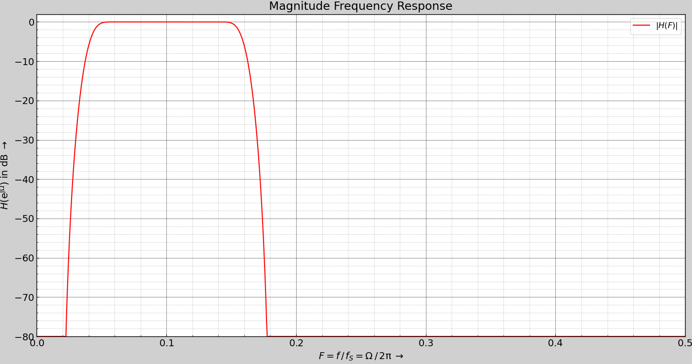

La gráfica muestra la respuesta en magnitud del filtro FIR diseñado con ventana Blackman-Harris. Se observa una banda pasante plana entre las frecuencias normalizadas correspondientes a 10 Hz (0.04) y 40 Hz (0.16), lo que indica que las componentes útiles del ECG se conservan sin atenuación significativa. A partir de 0.16, la magnitud desciende de manera pronunciada hasta superar los -80 dB de atenuación en la banda de parada, garantizando una supresión eficiente del ruido fuera de banda

##### Respuesta de fase

  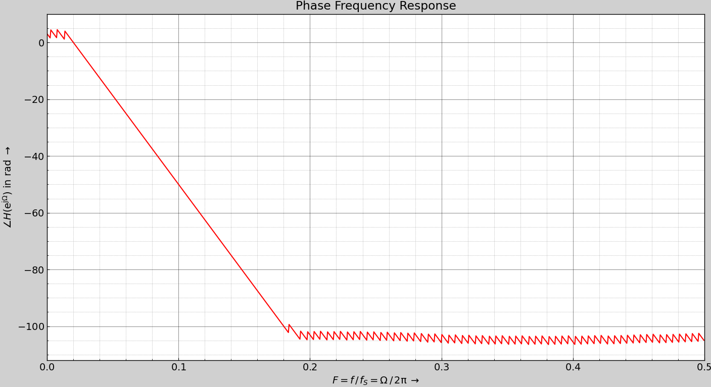

  
La gráfica de fase muestra una caída lineal en la banda de interés (hasta ~0.16), indicando que el filtro posee fase lineal en esa región. Esta propiedad es esencial en el procesamiento de ECG, ya que asegura que todas las frecuencias sufran el mismo retardo, preservando la morfología original de las ondas P, QRS y T. De esta manera, se evitan distorsiones temporales que podrían comprometer la interpretación clínica.

##### Gráfico P/Z

  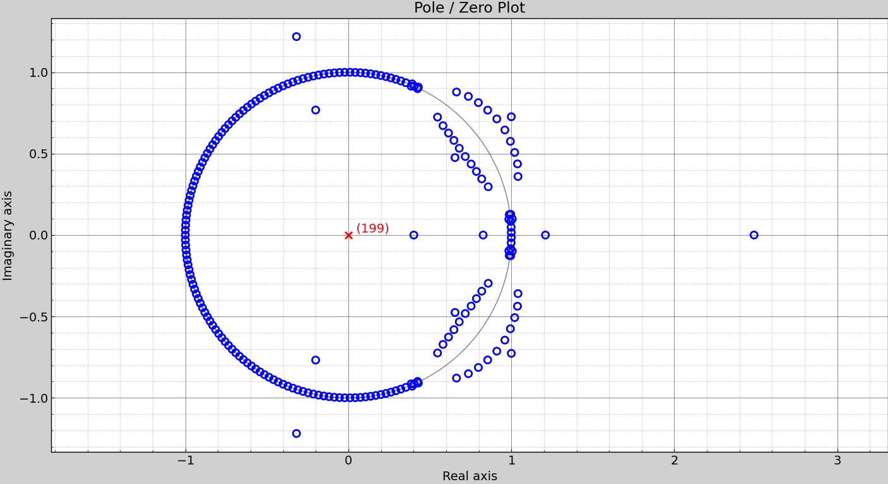

El diagrama de polos y ceros evidencia una distribución simétrica de ceros alrededor del origen, algunos extendiéndose más allá del círculo unitario, mientras que todos los polos se encuentran en el origen. Esta configuración refuerza la capacidad del filtro para producir transiciones abruptas sin comprometer la estabilidad ni introducir distorsiones en la señal.

#### Filtro FIR - Equiripple

##### Respuesta de magnitud

  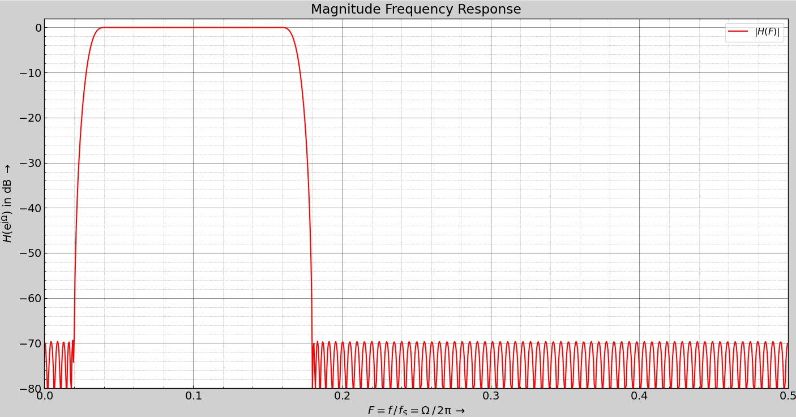

La respuesta en magnitud muestra una banda pasante estable entre las frecuencias normalizadas correspondientes a 10 Hz (0.04) y 40 Hz (0.16), con ripple controlado cercano a 0 dB. Tras la frecuencia de corte, la atenuación supera –70 dB, aunque con oscilaciones entre –70 y –80 dB. Este “ruido residual” es característico del método Equiripple, que distribuye el ripple en todas las bandas. A diferencia del filtro con ventana Blackman–Harris, ofrece menor orden y transiciones más abruptas, pero con un stopband menos limpio.

##### Respuesta de fase

  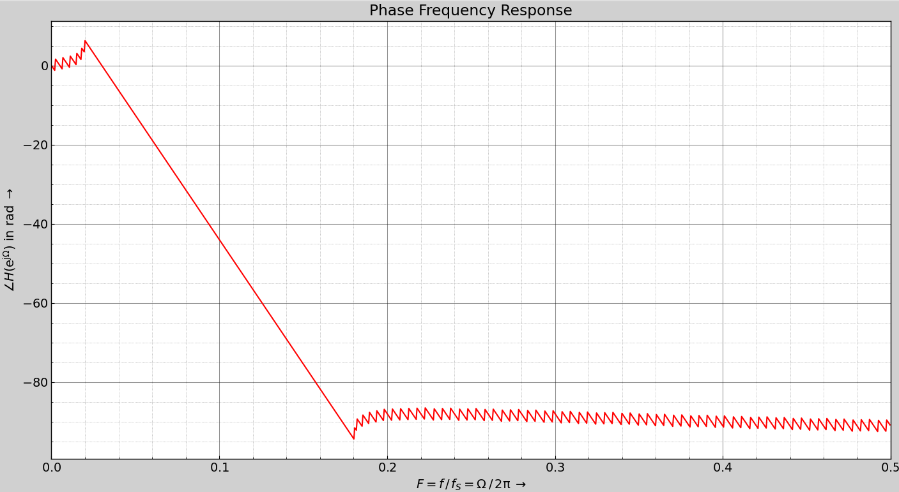

  
La respuesta de fase es principalmente lineal en la banda de interés (10–40 Hz), garantizando un retardo constante y preservando la morfología de las ondas ECG. Fuera de esta región aparecen oscilaciones periódicas con leves desviaciones alrededor de –90 rad, propias del diseño Equiripple. A diferencia del filtro con ventana Blackman–Harris, cuya fase se extiende hasta –105 rad con transiciones más suaves. Por lo que, este método optimiza el ripple a costa de un stopband menos limpio y una fase con más irregularidades.

##### Gráfico P/Z

  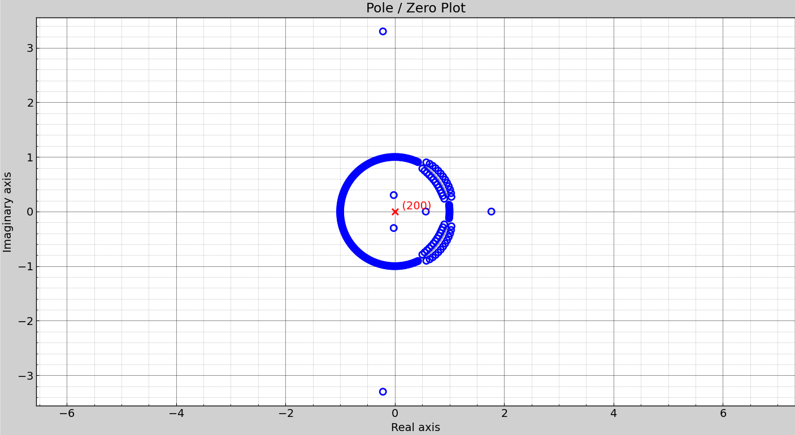

El diagrama de polos y ceros del filtro FIR Equiripple se evidencia todos los polos en el origen y ceros distribuidos simétricamente, algunos ubicados más alejados del círculo unitario. Esta disposición genera transiciones más abruptas y un control uniforme del ripple. En contraste, en el filtro con ventana Blackman–Harris los ceros también son simétricos, pero se concentran más cerca del círculo unitario, lo que produce transiciones más suaves y una banda de parada con menos oscilaciones.

#### Filtro FIR - Dolph Chebyshev

##### Respuesta de magnitud

  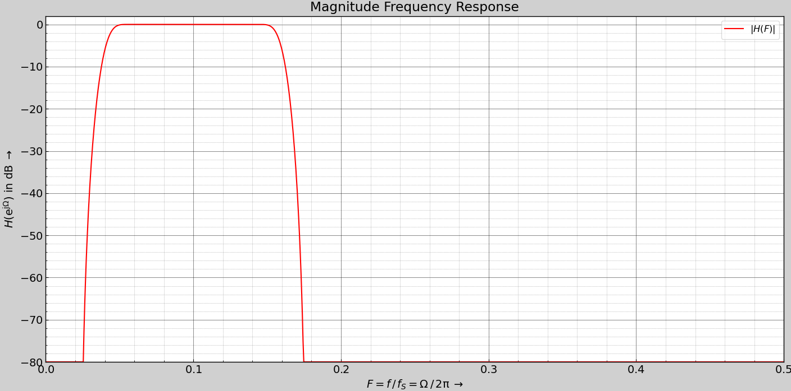

La gráfica muestra la respuesta en magnitud del filtro FIR diseñado con ventana Dolph Chebyshev. Se observa una banda pasante plana entre las frecuencias normalizadas correspondientes a 10 Hz (0.04) y 40 Hz (0.16), lo que indica que las componentes útiles del ECG se conservan sin atenuación significativa. A partir de 0.16, la magnitud desciende de manera pronunciada hasta superar los -80 dB de atenuación en la banda de parada, garantizando una supresión eficiente del ruido fuera de banda

##### Respuesta de fase

  

  
La respuesta de fase es principalmente lineal en la banda de interés (10–40 Hz), garantizando un retardo constante y preservando la morfología de las ondas ECG. Fuera de esta región se observan oscilaciones periódicas con leves desviaciones alrededor de –90 rad, seguidas de un ascenso hasta –85 rad donde la fase se estabiliza, comportamiento característico de la ventana Dolph–Chebyshev. En contraste, el filtro con ventana Blackman–Harris presenta una fase más prolongada, llegando hasta –105 rad, con transiciones más suaves. De este modo, el diseño Chebyshev prioriza la optimización del ripple a costa de un stopband menos limpio y una fase con mayores irregularidades.

##### Gráfico P/Z

  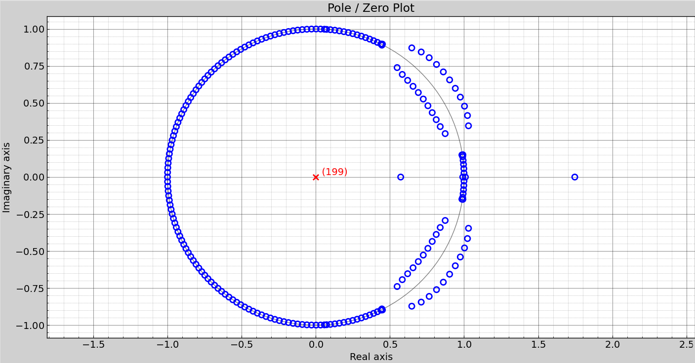

En el diagrama de polos y ceros del filtro FIR con ventana Dolph–Chebyshev, todos los polos se encuentran en el origen y los ceros se distribuyen de manera simétrica, con un cero ubicado más alejado del círculo unitario, lo que genera una banda de rechazo con oscilaciones relativamente marcadas. En contraste, en el filtro con ventana Blackman–Harris, aunque algunos ceros también se ubican fuera del círculo unitario, la mayoría se concentra cerca de él, produciendo transiciones más suaves en la respuesta en frecuencia y una banda de rechazo más plana, con menor amplitud de oscilaciones.

#### Filtro FIR - Blackman

##### Respuesta de magnitud

  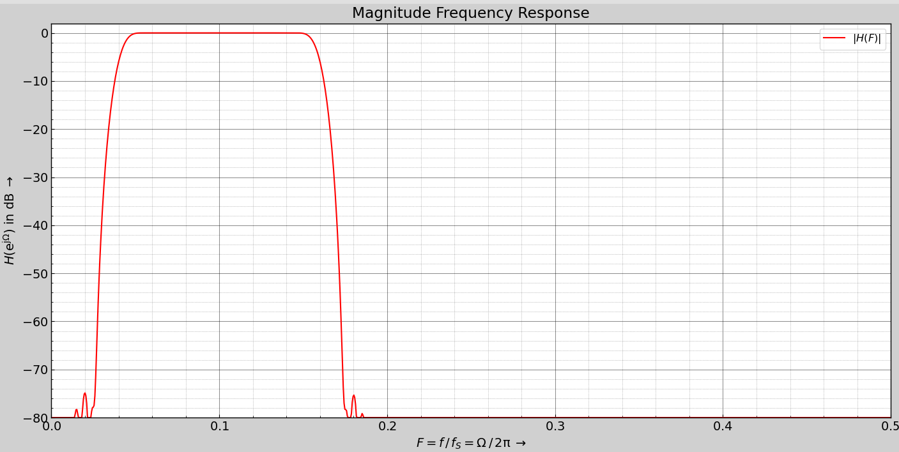

La gráfica muestra la respuesta en magnitud del filtro FIR diseñado con ventana Blackman. Se observa una banda pasante plana entre las frecuencias normalizadas correspondientes a 10 Hz (0.04) y 40 Hz (0.16), lo que indica que las componentes útiles del ECG se conservan sin atenuación significativa. A partir de 0.16, la magnitud desciende de manera pronunciada hasta superar los –70 dB en la banda de rechazo, lo que asegura una supresión eficiente del ruido fuera de banda; sin embargo, se observan pequeñas oscilaciones cercanas a –80 dB.

##### Respuesta de fase

  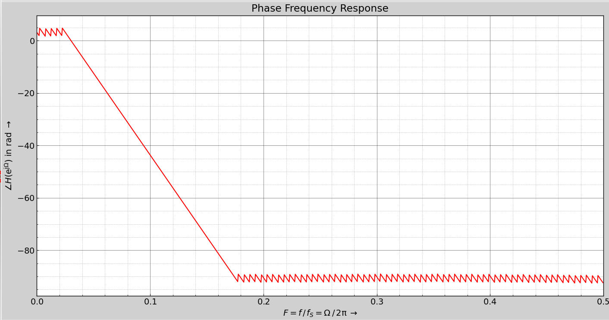

  
La respuesta de fase es principalmente lineal en la banda de interés (10–40 Hz), garantizando un retardo constante y preservando la morfología de las ondas ECG. Fuera de esta región se observan oscilaciones periódicas con leves desviaciones alrededor de –90 rad. En contraste, el filtro con ventana Blackman–Harris presenta una fase más prolongada, llegando hasta –105 rad, con transiciones más suaves. De este modo, el diseño Chebyshev prioriza la optimización del ripple a costa de un stopband menos limpio y una fase con mayores irregularidades.

##### Gráfico P/Z

  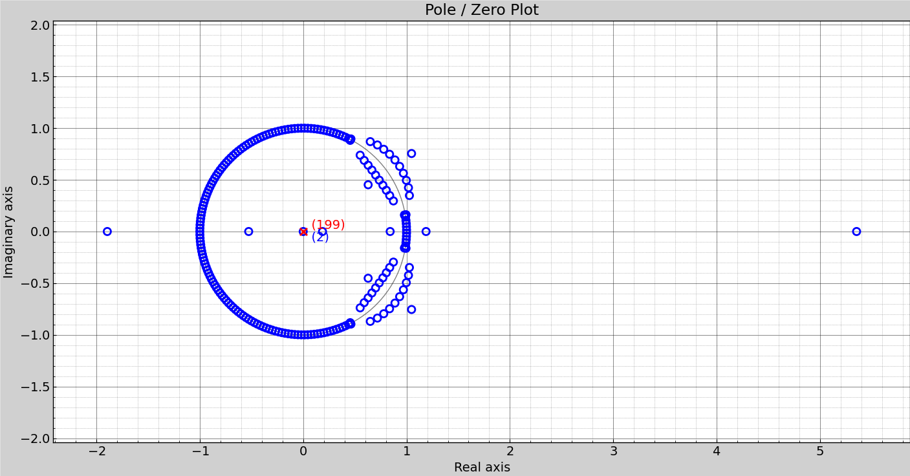

En el diagrama de polos y ceros del filtro FIR con ventana Blackman, todos los polos se sitúan en el origen y los ceros se distribuyen de manera simétrica, con dos ceros alejados del círculo unitario, lo que provoca una banda de rechazo con oscilaciones relativamente pronunciadas. En contraste, en el filtro con ventana Blackman–Harris, aunque algunos ceros también se ubican fuera del círculo unitario, la mayoría se concentra cerca de él, generando transiciones más suaves en la respuesta en frecuencia y una banda de rechazo más plana, con menor amplitud de oscilaciones.

## Referencias
1. a
2. b
3. c
4. d
5. Equibiomedic, "DESFIBRILADOR COMEN S5 V2," Archivo de diseño en CorelDRAW, disponible en: [https://share.google/2t6TcNHI1mN6FgopA ](https://equibiomedic.com/wp-content/uploads/2022/08/FICHA-TECNICA-DESFIBRILADOR-COMEN-S5-V2.pdf) 
6. S. Sarpal, "Difference between IIR and FIR filters: a practical design guide," Advanced Solutions Nederland, 28 Apr. 2020. [Online]. Available: https://www.advsolned.com/difference-between-iir-and-fir-filters-a-practical-design-guide/  

