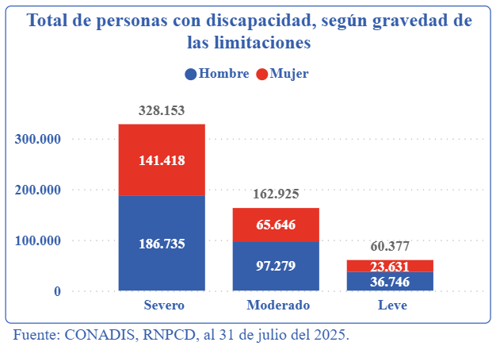

# Uso de Señales EEG/EOG en Sistemas BCI para la Detección de Parpadeos y Movimientos Oculares 

## ⚠️ Problemática a abordar
Las Interfaces Cerebro-Computadora (BCI) son sistemas que permiten establecer una conexión directa entre la actividad cerebral y el entorno, sin necesidad de recurrir a vías nerviosas o musculares convencionales. Estas tecnologías han surgido como alternativas de comunicación y control especialmente dirigidas a personas con limitaciones motoras severas, al traducir señales neurofisiológicas en comandos capaces de interactuar con dispositivos externos [1].

En el caso de las BCI basadas en electroencefalografía (EEG), las señales suelen verse contaminadas por artefactos generados por movimientos oculares y parpadeos [2]. En entornos clínicos este fenómeno se descarta por considerarse “ruido”; sin embargo, puede convertirse en una fuente valiosa de control para aplicaciones asistivas. Esto es posible porque el ojo se comporta como un dipolo eléctrico: la córnea presenta carga positiva y la retina negativa. Al mover los ojos en diferentes direcciones, varía la orientación del dipolo, lo que produce cambios de voltaje detectables en electrodos ubicados alrededor de la zona ocular, fenómeno conocido como electrooculografía (EOG).

Este proyecto propone una solución basada en un sistema EEG portátil (OpenBCI), capaz de detectar gestos oculares voluntarios —como parpadeos prolongados y guiños laterales— mediante electrodos ubicados cerca de los músculos oculares. El objetivo es permitir al paciente emitir comandos funcionales sin necesidad de movimiento corporal ni contacto físico, tales como:
- Parpadeo voluntario prolongado → Encendido del televisor
- Guiño del ojo derecho → Avanzar de canal
- Guiño del ojo izquierdo → Retroceder de canal

Esta propuesta resulta especialmente relevante para personas con tetraplejia, quienes conservan la capacidad de comunicarse verbalmente pero enfrentan limitaciones físicas que dificultan la interacción directa con dispositivos del entorno. Acciones cotidianas como encender el televisor, cambiar de canal o ajustar el volumen suelen requerir asistencia externa o tecnologías especializadas que no siempre están disponibles o adaptadas a sus necesidades.

La problemática técnica se centra en:
- La diferenciación precisa entre gestos voluntarios e involuntarios
- La adaptación del sistema a distintos niveles de sensibilidad muscular
- La implementación en tiempo real con bajo costo y alta portabilidad

Al integrar funciones domésticas en un sistema accesible y personalizado, se promueve una experiencia más digna, eficiente y tecnológicamente inclusiva para personas con movilidad reducida.

## 📊 Estadísticas

En la actualidad, más de **1 000 millones de personas** en el mundo enfrenta algún tipo de discapacidad, lo que equivale a 1 de cada 7 personas. De esta población, el 80% reside en países en desarrollo [3]. Nuestro país no es ajeno a esta problemática. Según el Consejo Nacional para la Integración de la Persona con Discapacidad (CONADIS), hasta el 31 de julio de 2025 se registran **55 534 personas con discapacidad en Perú** [4].

   

La gráfica evidencia que casi el **60%** de esta población enfrenta una discapacidad severa, condición que suele involucrar limitaciones motoras graves que obliga a muchas personas a depender de terceros para realizar incluso tareas básicas de comunicación o interacción con dispositivos.

## 🎯 Objetivos a alcanzar

- Desarrollar un sistema BCI no invasivo que utilice un EEG portátil (OpenBCI) para registrar tanto la actividad cerebral como los artefactos oculares (EOG) generados por parpadeos y movimientos oculares voluntarios.
- Proponer una solución orientada a mejorar la autonomía de personas con discapacidad motora severa.

## 🛠️ Herramientas a utilizar

- **Hardware**
  - Open BCI (EEG portátil): adquisición de señales EEG/EOG de manera no invasiva
  - Microcontrolador: módulo encargado de ejecutar los comandos detectados y controlar dispositivos externos.

- **Software**
  - Python

## 📚 Estado del Arte
### 1. MILimbEEG: A dataset of EEG signals related to upper and lower limb execution of motor and motor imagery tasks
La detección precisa y automática de la actividad neuronal de las extremidades superiores e inferiores mediante EEG puede ser útil en la rehabilitación de personas que sufren limitaciones de movilidad o discapacidades.

Este artículo presenta un conjunto de datos que contiene 7440 archivos CSV de 60 sujetos de prueba durante tareas motoras y de imaginería motora.

Las tareas motoras y de imaginería motora realizadas por los sujetos de prueba fueron: cerrar la mano izquierda, cerrar la mano derecha, flexión dorsal del pie izquierdo, flexión plantar del pie izquierdo, flexión dorsal del pie derecho, flexión plantar del pie derecho y descanso entre tareas.

  

Para garantizar la estandarización al registrar señales de EEG en las diferentes regiones de la corteza cerebral, la Sociedad Americana de Electroencefalografía (AES) definió el sistema internacional 10/10 - 64 electrodos, en el cual los electrodos se colocan en el cuero cabelludo con una separación del 10% entre ellos con respecto a las curvas sagital central y coronal central.

  

### 2. BLINKER: Automated extraction of ocular indices from eeg enabling large scale analysis
Proponen un proceso automatizado (BLINKER) para extraer índices oculares como la frecuencia de parpadeo, la duración del parpadeo y las relaciones entre la velocidad y la amplitud del parpadeo a partir de canales EEG, canales EOG
y/o componentes independientes (IC).

También investigan la dependencia de los índices oculares en función de la tarea en un estudio de tiradores. Además, implementaron el algoritmo en un toolbox de MATLAB de libre acceso llamado BLINKER. Este toolbox se puede aplicar a colecciones de datos sin intervención del usuario y permite descubrir cuáles canales o circuitos integrados capturan los parpadeos.

  

Los índices oculares que se pueden extraer fácilmente del EEG son la frecuencia de parpadeo, la duración del parpadeo, la relación de desviación de la amplitud del parpadeo, la relación de velocidad de amplitud positiva, la relación de velocidad de amplitud negativa, el porcentaje de tiempo con los ojos cerrados, así como las desviaciones estándar, las tasas de cambio y las relaciones de estas medidas.

BLINKER utiliza un umbral para la eliminación de valores atípicos y la selección de la mejor señal para identificar parpadeos. Las señales de los parpadeos tienen forma de carpa y una alta amplitud en relación con la señal de fondo.

  

El toolbox está disponible en https://github.com/VisLab/EEG-Blinks.
La documentación para el usuario y los ejemplos se encuentran en http://vislab.github.io/EEG-Blinks/.

### 3. Algoritmo con Interfaz Gráfica para la Detección Automática de Artefactos Oculares y Musculares en Señales EEG
Durante el registro de señales de un electroencefalograma se pueden presentar artefactos oculares y musculares, los cuales llegan a esconder la señal cerebral que se desea analizar; es por ello que proponen un algoritmo con interfaz gráfica, implementada en MATLAB, para la detección automática de dichos artefactos para minimizar el tiempo de procesamiento de señales EEG.

La detección se realiza a través del cálculo de la varianza y la curtosis en el dominio de la frecuencia, para el caso de artefactos oculares, y de la varianza en el dominio del tiempo, para el caso de artefactos musculares. Una vez detectados los artefactos, su eliminación se facilitará y permitirá al usuario agilizar el procesamiento de los datos EEG y realizar con éstos un análisis posterior. 

  

Además, se robustecerá el algoritmo de detección de ambos tipos de artefactos en el dominio del tiempo y frecuencia mediante pruebas con series de datos EEG de pacientes con Epilepsia focalizada y generalizada. 

## Referencias
- [1] T. C. A. R. Gentiletti G., “Interfaz Cerebro-Computadora: Estado del arte y desarrollo en Argentina,” Revista Argentina de Bioingeniería, vol. 13, nº 1, pp. 21–29, 2007.
- [2] P. F. Camillo S., “P300-based Brain-computer Interface: clinical applications and new possible directions,” en Proceedings of SIMPAR 2010 Workshops. Intl. Conf. on Simulation, Modeling and Programming for Autonomous Robots, Germany, 2010.
- [3] Naciones Unidas, "Día Internacional de las Personas con Discapacidad", Naciones Unidas, 2025. Disponible en: https://www.un.org/es/observances/day-of-persons-with-disabilities

- [4] Observatorio Nacional de la Discapacidad, Consejo Nacional para la Integración de la Persona con Discapacidad (CONADIS), “Discapacidad en cifras”, disponible en: https://observatorio.conadisperu.gob.pe/

