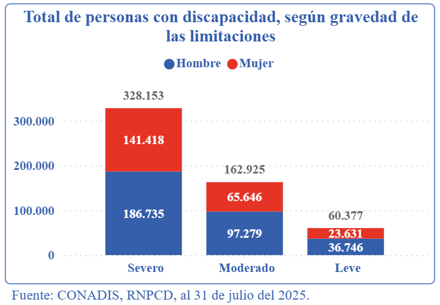

## Título tentativo del proyecto

## Problemática a abordar

### 📊 Estadísticas
Según el Consejo Nacional para la Integración de la Persona con Discapacidad **(CONADIS)** hasta el 31 de julio del 2025 se registra **55 534 personas con discapacidad** en el país [1].

La gráfica evidencia que casi el **60%** de esta población enfrenta una discapacidad severa, condición que suele involucrar limitaciones motoras graves que obliga a muchas personas a depender de terceros para realizar incluso tareas básicas de comunicación o interacción con dispositivos.

## Objetivos a alcanzar
## Herramientas a utilizar

## Referencias
[1] Observatorio Nacional de la Discapacidad, Consejo Nacional para la Integración de la Persona con Discapacidad (CONADIS), “Discapacidad en cifras”, disponible en: https://observatorio.conadisperu.gob.pe/
